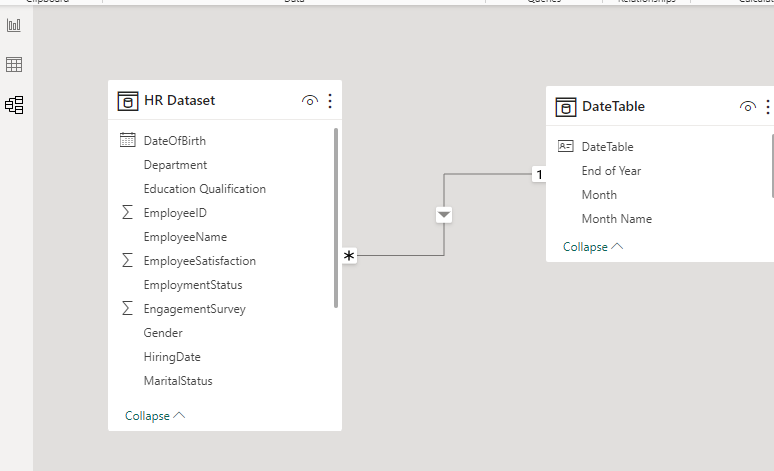
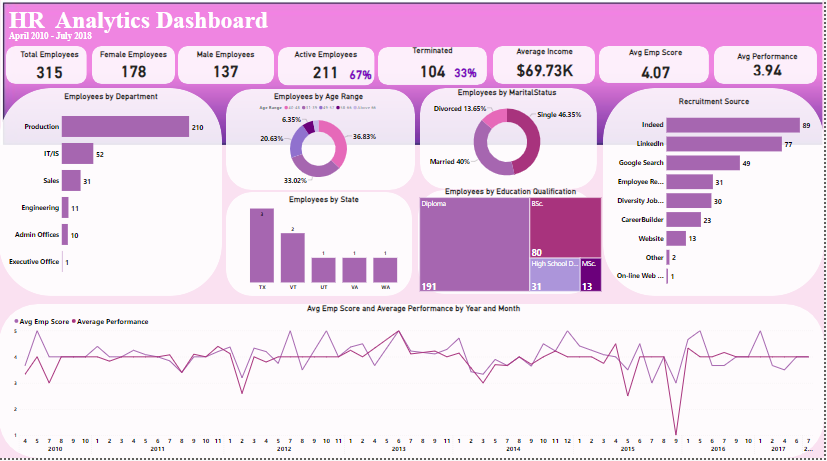
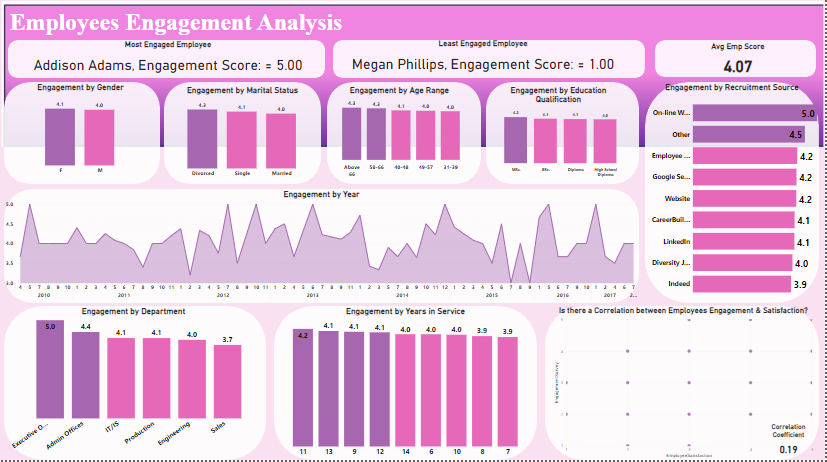
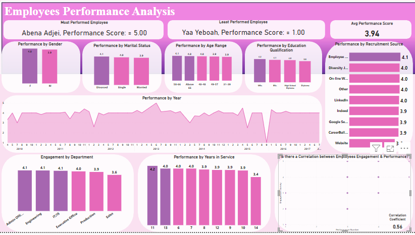
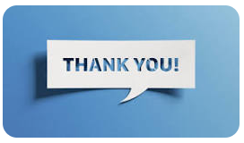

# Dynamic Dashboard Analysis for Peak Performance at GreenTech Innovation

## Introduction:
---
HR Analytics, also known as Human Resources Analytics or People Analytics, involves the collection, analysis, and interpretation of data to inform data-driven decisions in GreenTech Innovation. This process provides insights into various aspects of human resource management, including employee performance, recruitment, retention, engagement, and talent development. By leveraging HR Analytics, organizations can optimize HR strategies and align them with their overall goals and objectives. Despite its impressive 15-year history and leadership in the renewable energy sector, GreenTech Innovation faces critical human resources challenges that need to be addressed. This project aims to analyze key metrics such as employee performance, engagement, and growth. Additionally, it will explore how deficiencies in these areas could impact GreenTech Innovation’s business growth.

## Problem Statement
---
- Investigate employee engagement based on factors such as education qualification, age range, gender, marital status, recruitment source, and department.
- Examine the evolution of employee engagement over time.
- Determine whether a correlation exists between engagement and satisfaction, along with other variables.
- Explore employee performance in relation to education qualification, age range, gender, marital status, and department.
- Analyze how employee performance changes over time.
- Investigate whether a correlation can be established between performance and engagement, as well as other variables.

## Skills Demonstrated
---
- DAX
- Visualization
- Cross Filter

## Data Sourcing

The data was provided by AMDARI. To clean, analyse, and visualise the data, I imported the CSV file that I had downloaded into Power Bi.

## Data Transformation/Cleaning: 

Using Power BI's power query editor, a date table was created, and the dataset was effectively cleaned and transformed.

## Data Modelling: 

On the Power BI model view, a relationship was built between the HR dataset and the date table.

---

## Analysis and Visualization:

---

---

---

## Insights

1. **Education Level**:
- M.Sc. had the greatest engagement score, 4.35% greater than High School Diploma, with an overall score of 4.85.
- M.Sc. is the highest educational level achieved, followed by B.Sc., Diploma, and High School Diploma.

2. **Gender Breakdown**:
- Male employees are more engaged than female employees (0.53). This gap was especially noticeable among married employees.
- The engagement score for married male employees was 3.5.

3. **Tenure**:
- Employees with more than 7 years of tenure had a 3.35% higher engagement score than those with less, with the lowest score being 3.86.

4. **Age**:
- M.Sc. had the best engagement score among employees under 30 years old, but the lowest average Net Promoter Score of 3.15.

5. Job Role:
- The Help Desk role had the highest average Net Promoter Score, at 4.6. Clerk was the lowest-paying position.

6. **Employees with Over 10 Years of Experience**:
- Employees aged 30-40 with the highest financial support (salary) had 0.43% better engagement scores.

7. **contentment and Performance**:
- A positive association was found between contentment and performance, with higher performance resulting in more satisfaction. The link between performance and engagement was weaker, at 0.19.
- Employees with the highest performance ratings received the greatest engagement scores.

8. **Retention**:
- Employees with less than 7 years of tenure saw a 10% boost in retention, while those with more than 10 years saw a 12% rise.

## Recommendation
---
- Provide additional help or chances for employees with lesser educational credentials to increase their engagement and performance, as they currently score lower than those with higher degrees.
  
- Investigate the effect of varied staff support on engagement and performance. Consider giving assistance for women in different marital statuses, as this may contribute to increased engagement and performance.
  
- Examine the efficacy of various surveys with an emphasis on increasing participation. Consider investing more in surveys with greater engagement scores, such as Do Not Use Appraisals.

- Explore the varying performance of older employees. A broad age range of longstanding employees suggests varying degrees of engagement. Giving opportunities to older employees to share their experiences and struggles is recommended.
  
- Leverage the high performance of employees with 7 and 10 years of service. Retention strategies or career development opportunities can be developed to train and further enhance the performance of these employees.
  
- Learn from the Admin Office desk team, which had the highest performance scores; this desk provides clear deliverables to improve overall performance rates.

---

I’m open to collaborating on projects related to data analysis, and data visualization. You can reach me via email at [lindyogundokun1@gmail.com] or connect with me on LinkedIn at [https://www.linkedin.com/in/lindyogundokun] Feel free to drop me a message anytime; I’m excited to connect and collaborate with fellow data enthusiasts! Let’s work together to solve interesting data challenges!
